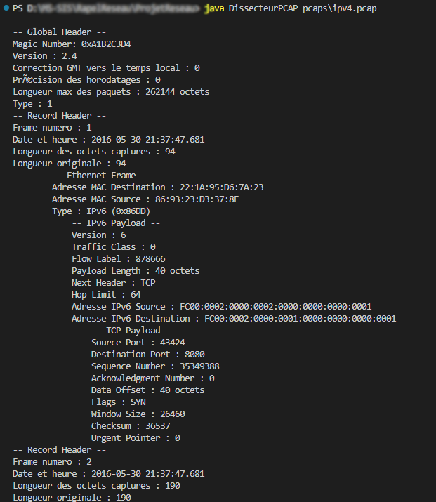

# pcap-dissector

Analyseur de fichiers PCAP en ligne de commande de type Wireshark, développé dans le cadre du Mastère Spécialisé en Sécurité des Systèmes d'Information (MS-SIS).
Ce projet est un analyseur de paquets réseau qui permet de décoder et d'afficher les informations contenues dans différents protocoles de la suite `TCP/IP`, y compris `IPv4`, `IPv6`, `TCP`, `UDP`, `ICMP`, `HTTP`, `FTP` et `DHCP`. Le programme lit les paquets à partir d'un fichier `PCAP`, analyse les en-têtes des protocoles et extrait des informations pertinentes pour chaque paquet.
## Protocoles supportés

| Couche          | Protocoles            |
| --------------- | --------------------- |
| **Liaison**     | `Ethernet`, `ARP`     |
| **Réseau**      | `IPv4`, `IPv6`        |
| **Transport**   | `TCP`, `UDP`          |
| **Application** | `DHCP`, `HTTP`, `FTP` |
| **Contrôle**    | `ICMPv4`, `ICMPv6`    |

> Protocoles pas encore implémentés : `DNS`, `QUIC`, `Follow TCP Stream`.

## Architecture

Chaque protocole est géré par sa propre classe Java, ce qui permet une organisation claire et extensible.
```
DissecteurPCAP.java     ← Point d'entrée, boucle de lecture
PCAPFile.java           ← Gestion du fichier PCAP
GlobalHeader.java       ← En-tête global du fichier PCAP
RecordHeader.java       ← En-tête de chaque enregistrement
EthernetFrame.java      ← Trame Ethernet + dispatch vers les couches supérieures
├── ARP.java
├── IPv4.java
└── IPv6.java
      ↓ (partagés par IPv4 et IPv6)
      ├── TCP.java        ← inclut HTTP et FTP
      ├── UDP.java        ← inclut DHCP
      ├── ICMPv4.java
      └── ICMPv6.java
```

## Fonctionnement

1. **Ouverture du fichier PCAP** : Le programme commence par ouvrir un fichier au format `PCAP`. Il lit l'en-tête global (Global Header), qui contient des informations sur la capture, telles que le format de `timestamp`, la taille des paquets et le type de liaison de données.
2. **Lecture des record headers** : Ensuite, le programme entre dans une boucle pour lire chaque `record header`. Pour chaque record, il extrait les données essentielles, y compris le `timestamp` et la longueur du paquet.
3. **Analyse de la trame Ethernet** : Pour chaque record, le programme affiche d'abord les informations de la trame Ethernet, telles que les adresses `MAC` source et destination, ainsi que le type de protocole contenu dans la trame.
4. **Décodage des protocoles de couche supérieure** :
   * **`IPv4`** et **`IPv6`** : Selon le type de protocole de la trame Ethernet, le programme passe à l'analyse de l'en-tête `IPv4` ou `IPv6`. Il extrait des informations telles que les adresses `IP` source et destination, la version du protocole, la taille de l'en-tête ...
   * **`TCP`** et **`UDP`** : Après l'analyse de l'en-tête `IP`, le programme analyse le protocole de transport, qu'il s'agisse de `TCP` ou d'`UDP`. Pour `TCP`, il extrait des données comme les ports source et destination, les numéros de séquence et d'accusé de réception, ainsi que les indicateurs de contrôle (`flags`). Pour `UDP`, il lit simplement les ports et la longueur.
   * **`ICMP`** : Si le paquet contient un message `ICMP`, le programme décode les champs de type et de code pour identifier le type de message `ICMP`.
   * **`HTTP`** et **`FTP`** : Lorsqu'un paquet `HTTP` ou `FTP` est détecté, le programme extrait et affiche les lignes pertinentes de la requête ou de la réponse, ce qui aide à comprendre les interactions entre le client et le serveur.
   * **`DHCP`** : Les paquets `DHCP` sont analysés pour extraire les adresses `IP` assignées et d'autres options `DHCP` pertinentes.
5. **Affichage structuré** : Les informations décodées sont présentées de manière structurée et lisible dans la console, facilitant l'examen des communications réseau. 

## Prérequis

- `java 17.0.5 2022-10-18 LTS`
- Développer sur Windows
- Aucune dépendance externe (librairies standard uniquement : `java.io`, `java.util`, `java.time`, `java.nio`)
## Exécution
```bash
java DissecteurPCAP fichier.pcap
```

Exemple :


